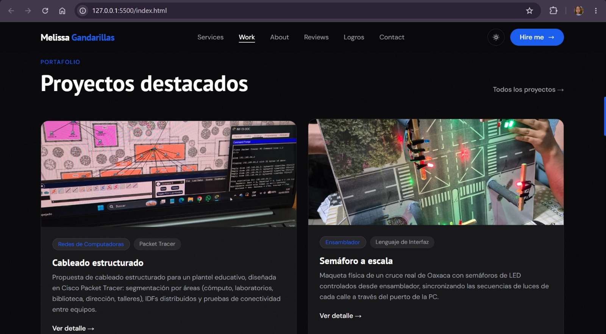
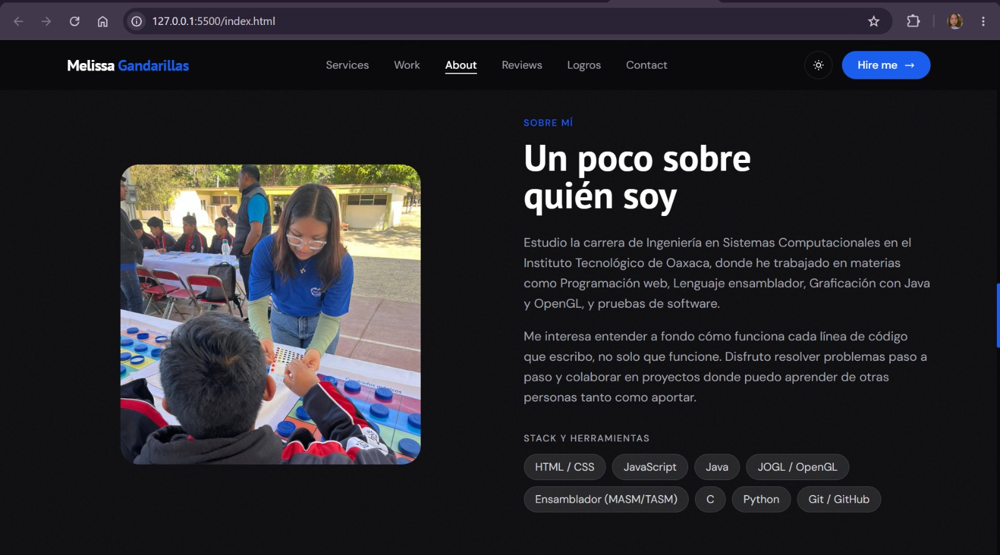
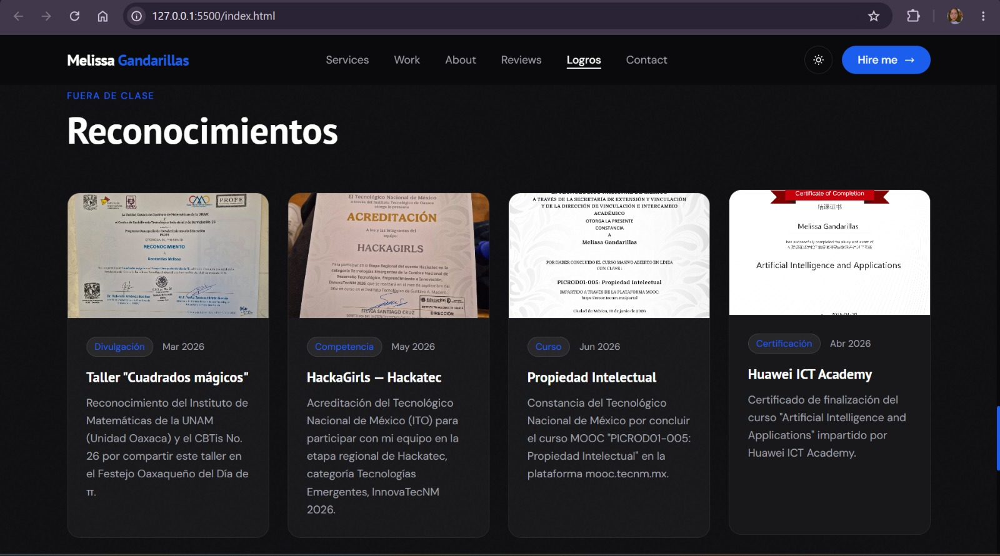

# Creación de Portafolio a Través de una Plantilla con Tailwind

Portafolio construido con HTML, CSS y JS.

**Objetivo:** Crear un portafolio basado en una plantilla de Tailwind CSS

**Actividad 4 - Programación Web**

Tecnológico Nacional de México, Instituto Tecnológico de Oaxaca

**Alumna:** Melissa Gandarillas

## Descripción del proyecto

Este portafolio presenta algunos de mis proyectos, habilidades y reconocimientos como estudiante de Ingeniería en Sistemas Computacionales. Está construido con HTML, JavaScript y el framework CSS Tailwind, usado directamente desde su CDN, sin necesidad de instalar ni compilar nada.

La plantilla tomada como base es **Folio**, de Laurent Begey, distribuida por ThemeWagon:
- Repositorio: https://github.com/themewagon/folio-html
- Descarga: https://themewagon.com/themes/folio-tailwind/

La plantilla original está pensada para un diseñador/desarrollador freelance ficticio (Eliott), con secciones de servicios, portafolio, reseñas de clientes y blog. Se conserva prácticamente toda su estructura y estilo visual, pero el contenido y algunas secciones se adaptaron para funcionar como un portafolio académico en vez de uno de freelancer.

La plantilla también usa Alpine.js, una librería ligera para añadir interactividad (menú móvil, modo oscuro, animaciones al hacer scroll) directamente con atributos en el HTML. Cabe aclarar que no es un framework de componentes como React o Vue.

### Secciones que componen el portafolio

- **Inicio:** Foto de perfil, mi nombre y una breve descripción de quién soy y qué estudio.
- **Áreas de trabajo:** Tres tarjetas que resumen mis principales líneas de trabajo: Desarrollo Web, Gráficos 3D y Programación de Bajo Nivel.
- **Proyectos destacados:** Cuatro proyectos reales desarrollados durante la carrera: una propuesta de cableado estructurado, un semáforo a escala controlado por ensamblador, un elevador controlado por ensamblador, y una maqueta física de una casa de tres pisos.
- **Sobre mí:** Una descripción más personal sobre mi formación, mis materias y mi forma de trabajar, junto con las tecnologías y herramientas que manejo.
- **Lo que dicen de mi trabajo:** Comentarios de una compañera de equipo, un profesor y un compañero de clase sobre distintos proyectos en los que he trabajado.
- **Reconocimientos:** Constancias y certificados que he obtenido fuera de clase, como talleres de divulgación, competencias tecnológicas y cursos en línea.
- **Contacto:** Un formulario de contacto y mis datos de contacto directo (correo, LinkedIn y GitHub).

## Proceso de creación

1. Elegí la plantilla **Folio** de Laurent Begey / ThemeWagon porque está construida con HTML y Tailwind CSS, tiene licencia MIT que permite modificarla y subirla a un repositorio público, y ya trae una estructura de secciones muy parecida a la de un portafolio.

2. Descargué la plantilla y la coloqué en la raíz de mi proyecto como `index.html`. Las páginas adicionales que trae la plantilla (`blog.html`, `blog-article.html`, `case-study.html`, `projects.html`) se movieron a una carpeta `tailwind/`, para mantener separado el código original de la plantilla de mis propios archivos.

3. Extraje el `<script>` de JavaScript que estaba escrito directamente dentro del `index.html` (la función `app()` que controla el modo oscuro, el menú móvil y las animaciones al hacer scroll) y lo guardé en `tailwind/js/app.js`, enlazándolo desde el HTML con una etiqueta `<script src="tailwind/js/app.js">`.

4. De la misma forma, extraje el bloque `<style>` con los estilos personalizados de la plantilla y lo guardé en `tailwind/css/style.css`, enlazado con una etiqueta `<link rel="stylesheet">`.

5. Cambié el nombre y la foto de perfil de la sección de inicio por los míos, y reescribí la descripción para que hablara de mi carrera en vez de un perfil de diseñador freelance.

6. Reemplacé la sección de "Servicios" por tres áreas reales de mi formación: Desarrollo Web, Gráficos 3D  con Java y JOGL/OpenGL, y Programación de Bajo Nivel (ensamblador y C).

7. Sustituí los proyectos de ejemplo de la sección de portafolio por cuatro proyectos reales que he desarrollado en distintas materias: cableado estructurado (Redes de Computadoras), semáforo a escala y elevador (ambos de Lenguaje de Interfaz, en ensamblador), y una maqueta de una casa de tres pisos (Graficación).

8. Reescribí la sección "Sobre mí" con información real sobre mi carrera, mis materias y las herramientas que uso (HTML, CSS, JavaScript, Tailwind CSS, Java, JOGL/OpenGL, ensamblador, C, Python, Git y GitHub).

9. Adapté la sección de reseñas de clientes para mostrar comentarios de personas con las que he trabajado en la escuela: una compañera de equipo, un profesor y un compañero de clase.

10. Reemplacé la sección de blog por una de **Reconocimientos**, ya que le vi mas sentido colocar constancias reales en vez de artículos de blog inventados. Aquí incluí un taller de divulgación matemática, una acreditación para una competencia de innovación tecnológica, un curso en línea sobre propiedad intelectual y una certificación de Huawei ICT Academy.

11. Actualicé la sección de contacto con mis propios datos, y el pie de página conservando el crédito a Laurent Begey y ThemeWagon como autores originales de la plantilla, tal como lo requiere su licencia.

##Capturas de pantalla

Sección de proyectos propios

Sección "about me" con información propia

Sección de reconocimientos académicos, de participación en eventos de divulgación cientifica, certificados

